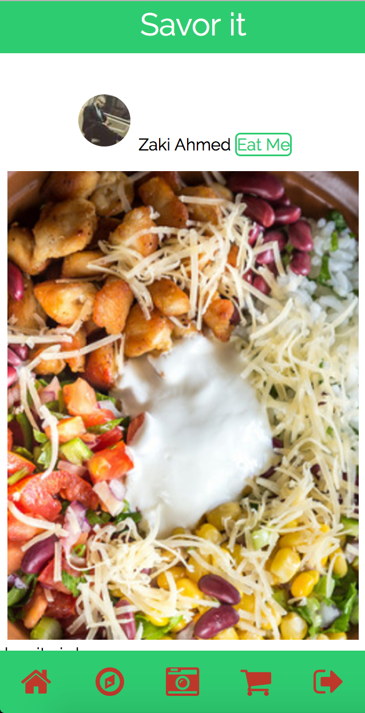
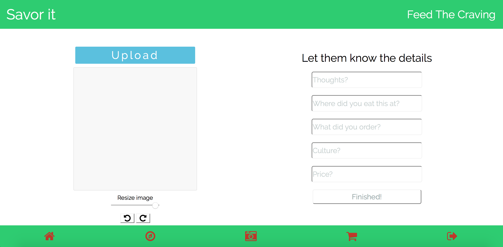

# Savorit
is a social media application solely for food with a twist. The premise being that people love food, impulse shopping and socializing and this combines all three. The application helps you find what you want to eat by looking at what your friends are posting of what they have been eating across your local area. Whatever they post you can order to your home as a food delivery combining a social aspect with a food service aspect. savorit.herokuapp.com is the live site where you can demo the idea just sign up!

#My name is Zaki Ahmed,
& I am a ruby on rails engineer, 24 years old out of Houston TX looking to grow as a developer.

#CONTACT INFO
email: reach.zaki.ahmed@gmail.com
Portfolio: www.zakiahmed.org

